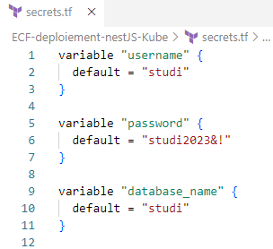
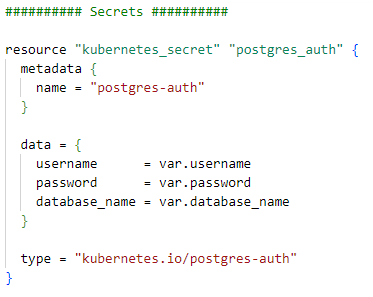

# ECF Hello World (NestJS)
📅 [**Planning Notion**](https://mirror-paw-f24.notion.site/f2fa7cecae5a4cd4a1792bf963ec744a?v=b71bd3754f5541c1a7c1a23cbb2f1ca9) 📅  
___ 
## Table of content
- [ECF Hello World (NestJS)](#ecf-hello-world-nestjs)
  - [Table of content](#table-of-content)
  - [Activité Type 1 : Automatisation du déploiement d’infrastructure dans le Cloud](#activité-type-1--automatisation-du-déploiement-dinfrastructure-dans-le-cloud)
    - [1. Préparez un kube kubernetes en utilisant Terraform](#1-préparez-un-kube-kubernetes-en-utilisant-terraform)
    - [2. Ajoutez/configurez les variables d’environnement qui se connectent à la BDD](#2-ajoutezconfigurez-les-variables-denvironnement-qui-se-connectent-à-la-bdd)
  - [Activité Type 2 : Déploiement d’une application en continu](#activité-type-2--déploiement-dune-application-en-continu)
    - [3. Écrivez le script qui build/test et le nodejs et déployez le sur le kube créé](#3-écrivez-le-script-qui-buildtest-et-le-nodejs-et-déployez-le-sur-le-kube-créé)
      - [3.1 Utilisation de AWS Codepipeline](#31-utilisation-de-aws-codepipeline)
      - [3.2 Utilisation de AWS CodeBuild](#32-utilisation-de-aws-codebuild)
      - [3.3 déploiement de l'application nestjs dans le Kube (AWS EKS)](#33-déploiement-de-lapplication-nestjs-dans-le-kube-aws-eks)
  - [Sources utilisées](#sources-utilisées)

## Activité Type 1 : Automatisation du déploiement d’infrastructure dans le Cloud  

### 1. Préparez un kube kubernetes en utilisant Terraform 

❗ Cette partie a été traitée dans le repository [ECF-Hello-world-nestJS](https://github.com/Morlok502/ECF-infrastructure).  
➡ Voir [README.md](https://github.com/Morlok502/ECF-infrastructure#1-pr%C3%A9parez-un-kube-kubernetes-en-utilisant-terraform-3-points) pour le détail de cette étape.  

### 2. Ajoutez/configurez les variables d’environnement qui se connectent à la BDD  

- Création d'un fichier secrets.tf contenant les variables :  
  
- ajout de `secrets.tf` dans `.gitignore` afin de ne pas le push vers le repository.  
- ajout d'une ressource `kubernetes_secret` pour passer ces variables à notre cluster  
  
- après déploiement, les secrets ont bien été ajoutés dans notre cluster EKS  

## Activité Type 2 : Déploiement d’une application en continu

### 3. Écrivez le script qui build/test et le nodejs et déployez le sur le kube créé

#### 3.1 Utilisation de AWS Codepipeline

❗  Cette partie a été traitée dans le repository [ECF-Hello-world-nestJS](https://github.com/Morlok502/ECF-Hello-world-nestJS).  
➡ Voir [README.md](https://github.com/Morlok502/ECF-Hello-world-nestJS#31-utilisation-de-aws-codepipeline) pour le détail de cette étape.  

#### 3.2 Utilisation de AWS CodeBuild

❗ Cette partie a été traitée dans le repository [ECF-Hello-world-nestJS](https://github.com/Morlok502/ECF-Hello-world-nestJS).  
Voir [README.md](https://github.com/Morlok502/ECF-Hello-world-nestJS#32-utilisation-de-aws-codebuild) pour le détail de cette étape.    

#### 3.3 déploiement de l'application nestjs dans le Kube (AWS EKS)

## Sources utilisées  

[YouTube - Getting Started with EKS and Terraform](https://www.youtube.com/watch?v=Qy2A_yJH5-o&list=WL&index=18)
[Terraform - kubernetes_secret](https://registry.terraform.io/providers/hashicorp/kubernetes/latest/docs/resources/secret) 
